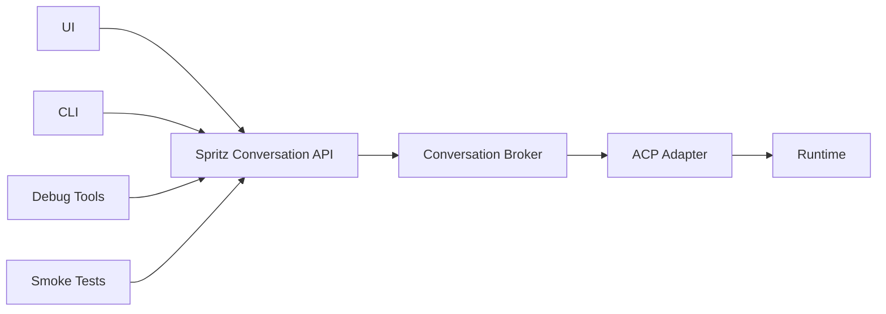

## Overview

This document defines the long-term architecture for conversation execution in
Spritz.

The target model is:

- clients use a simple Spritz-native conversation API,
- Spritz owns conversation execution as a control-plane capability,
- ACP remains the runtime protocol behind that layer,
- UI, CLI, debug tools, smoke tests, and automation all use the same broker,
- runtime-specific session behavior is hidden behind adapters instead of
  leaking into every client.

This is the preferred end state for an elegant and production-ready
conversation system.

The existing internal debug-chat endpoint is a useful phase-one step, but it is
not the final architecture.

## Problem

ACP is a good runtime protocol, but it is not a complete product API for
Spritz.

If clients speak raw ACP directly, each client must understand how to:

- open and manage ACP connections,
- initialize protocol state,
- bind or load sessions,
- distinguish replayed history from fresh output,
- send prompts,
- handle permission requests,
- cancel prompts,
- recover from disconnects,
- interpret runtime-specific timing and replay behavior.

That approach appears simple at first, but it spreads session-state logic
across:

- the web UI,
- the CLI,
- internal debug tools,
- smoke tests,
- future integrations.

Once that happens, each caller becomes a small conversation broker. The result
is:

- duplicated state-machine logic,
- inconsistent behavior across clients,
- weaker observability,
- harder authorization and audit enforcement,
- more fragile production behavior.

## Why Spritz Should Wrap ACP

Spritz should wrap ACP because ACP and the Spritz product boundary solve
different problems.

ACP should remain:

- the protocol between Spritz and runtimes,
- the portability layer for runtime providers,
- the low-level transport for session and prompt execution.

Spritz should own:

- authentication,
- authorization,
- ownership policy,
- audit logging,
- replay and prompt lifecycle management,
- conversation state normalization,
- public and internal API stability.

In other words:

- ACP is the runtime contract,
- the broker is the product contract.

This is not duplication.

It is the standard layering:

- low-level protocol inside,
- product-oriented API outside.

## Goals

- Make conversation send, stream, and cancel first-class Spritz operations.
- Keep ACP internal to the control plane whenever possible.
- Centralize conversation state handling in one broker layer.
- Eliminate replay/prompt lifecycle logic from most clients.
- Preserve runtime portability through ACP adapters.
- Provide one path that serves normal chat, debug, CLI, smoke tests, and
  automation.
- Keep the architecture compatible with local development, staging, and
  production.

## Non-goals

- Replacing ACP between Spritz and runtimes.
- Requiring a separate microservice on day one.
- Breaking existing chat contracts in one migration.
- Removing browser-based end-to-end testing.
- Exposing privileged debug behavior to normal end users.

## Design Principle

### Broker first, microservice later if needed

The broker should start as an internal subsystem inside `spritz-api`.

That gives Spritz:

- one logical boundary,
- one owner for conversation execution,
- low migration cost,
- minimal operational overhead.

If scale, isolation, or team boundaries later justify it, the same broker can
be split into a dedicated service.

The important boundary is logical first, not process-level first.

## Target Architecture

### External API shape

Clients should talk to a simple Spritz-native API such as:

- `POST /api/conversations/{id}/messages`
- `GET /api/conversations/{id}/events`
- `POST /api/conversations/{id}:cancel`

Privileged internal variants can exist for:

- owner-scoped debug,
- audited break-glass access,
- smoke or CI automation.

The important part is that these APIs describe product operations, not ACP
steps.

Clients should ask for:

- send this message,
- stream this conversation,
- cancel this prompt.

Clients should not need to know about:

- `initialize`,
- `session/load`,
- `session/prompt`,
- replay draining heuristics,
- runtime-specific session repair logic.

### Broker responsibilities

The broker should be the only layer that knows how to:

- resolve a conversation target to a runtime,
- bind or repair runtime session ids,
- load historical transcript state,
- separate replay from fresh prompt output,
- forward prompts,
- stream normalized updates,
- cancel in-flight work,
- translate runtime/protocol errors into stable Spritz errors,
- emit audit and observability events.

### ACP adapter responsibilities

The ACP adapter should translate broker operations into ACP protocol behavior.

That adapter should own:

- ACP connection management,
- ACP request and notification handling,
- runtime capability probing,
- session bootstrap and repair,
- runtime-specific quirks hidden behind a stable interface.

This keeps ACP pure without making it the public API boundary.

## Why This Is Better Than Pure ACP Exposure

This architecture gives a simpler system overall.

### With pure ACP exposure

Each client must implement:

- session lifecycle management,
- replay handling,
- cancellation,
- timeout policy,
- permission request policy,
- output normalization.

### With a conversation broker

Each client implements:

- call the Spritz API,
- render messages,
- optionally stream events.

The broker carries the hard logic once.

That is simpler for the whole platform even if the broker itself is more
capable than a thin ACP proxy.

## Authorization Model

The broker should enforce policy directly instead of relying on scattered
transport assumptions.

At minimum it should support:

- caller owns the conversation,
- caller owns the target instance,
- privileged internal debug scopes,
- explicit break-glass access for cross-owner actions,
- environment-specific restrictions,
- full audit logging.

This is cleaner than making clients combine:

- auth middleware,
- internal tokens,
- owner checks,
- ad hoc admin exceptions.

## Event Model

The broker should expose a stable event model that is product-oriented rather
than protocol-oriented.

For example:

- `conversation.replay.started`
- `conversation.replay.completed`
- `conversation.message.delta`
- `conversation.message.completed`
- `conversation.tool.started`
- `conversation.tool.updated`
- `conversation.prompt.completed`
- `conversation.prompt.cancelled`

Internally, ACP may still emit `session/update` messages with runtime-specific
shapes.

The broker should normalize those before they reach most clients.

This is the cleanest way to eliminate replay-boundary heuristics from callers.

## Operational Model

The broker should support:

- local development through `spritz-api`,
- staging and production with the same API shape,
- request tracing across the conversation lifecycle,
- structured audit logs,
- stable timeout and cancellation policy,
- reusable smoke and regression tests.

This also makes it straightforward to build:

- a privileged CLI,
- repeatable conversation smoke tests,
- internal support tooling,
- future server-side automation.

## Migration Strategy

This should be introduced as a strangler refactor, not a rewrite.

### Phase 1

Keep the existing phase-one debug path:

- `POST /api/internal/v1/debug/chat/send`
- `spz chat send`

This is already useful and should remain working.

### Phase 2

Move the internal debug path onto a broker abstraction inside `spritz-api`.

At this point:

- the outer API stays the same,
- the handler becomes thinner,
- ACP orchestration moves into the broker and adapter.

### Phase 3

Move existing chat and conversation-loading flows onto the same broker.

This should happen behind compatibility-preserving endpoints so the UI does not
break during migration.

### Phase 4

Once all primary paths use the broker:

- reduce direct ACP knowledge in the UI and CLI,
- keep raw ACP access only for narrow low-level cases,
- treat the broker as the canonical conversation execution layer.

## Compatibility Guidance

The safe migration rule is:

- keep current API contracts stable,
- replace implementation under them,
- verify behavior parity before cutting over the next caller.

This is especially important for:

- conversation bootstrap,
- transcript replay,
- prompt send,
- cancel behavior,
- reconnect behavior,
- permission handling.

## Risks

If Spritz continues to rely on raw ACP semantics at too many boundaries, the
main risks are:

- replay and prompt output getting mixed,
- inconsistent behavior between clients,
- duplicated timeout logic,
- weaker authorization guarantees,
- harder production debugging.

If the broker becomes the canonical layer, the main risk is over-designing it
too early.

That is why the recommended path is:

- start as an internal subsystem,
- keep the API small,
- migrate call paths incrementally,
- split into a separate service only if the platform truly needs it.

## Recommended End State

The preferred end state for Spritz is:

- one simple Spritz-native conversation API,
- one canonical broker implementation,
- ACP retained as the runtime protocol behind adapters,
- all major clients sharing the same execution path,
- auth, audit, and lifecycle policy enforced in one place.

That is the cleanest way to make Spritz conversations both simple at the
surface and production-ready underneath.
